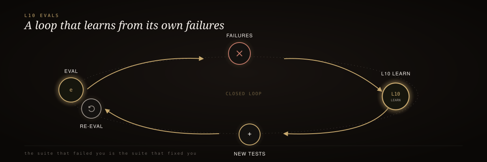

<div align="center">
<p align="center"></p>
  
</div>

<br/>

<div align="center">
  <h3>RIG-Enhanced Evals</h3>
  <p><em>Self-evolving LLM evaluation with proof-gated results.</em></p>
</div>

<div align="center">


[](https://github.com/mrodgersjs-web/rig-enhanced-evals/actions/workflows/smoke.yml)


</div>

<br/>

> 🥇 Most eval frameworks treat a failing test as a line in a report. `rig-enhanced-evals` treats it as **unassimilated signal**: if the same mistake keeps happening, the evaluator gets harder to fool — and the proof that it did is checkable by someone who wasn't in the room.

Does the same job as `deepeval` or `promptfoo` — score a response against faithfulness, relevance, toxicity, format compliance — with two things bolted on: an **L10 self-evolving harness** that mutates its own detection state on repeated failure, and **proof-gated results** sealed into HMAC-signed ProofPackets.

## 60-second install

```bash
python3 -m pytest test/ -v          # unit tests
bash .rig/smoke.sh                  # L10 smoke: prove the loop learns
bash .rig/verify.sh                 # L8: syntax -> unit -> ... -> sign-off
python3 -m src.l10_harness --reset --generations 5   # run the harness directly
```

<sup>A single <code>bash .rig/smoke.sh</code> run against the reference fixtures converges in exactly 3 generations — gen 1 surfaces 4 ground-truth mismatches, gen 2 hardens all 4 patterns and pins 4 regression cases, gen 3 re-evaluates the now-14-case suite with zero mismatches.</sup>

## How it works

<div align="center">
  
</div>

<sub align="center">evaluate → seal ProofPacket → learn() on mismatch → harden state + pin regression case → next generation → convergence</sub>

```text
Evaluator.evaluate_case(case)
    -> runs one of 4 metrics against lenient default state
    -> seals an HMAC-signed ProofPacket for the result

Evaluator.learn(result, case)
    -> no-op if result.passed == case.expected_pass
    -> otherwise appends a failure record + bumps a pattern counter
    -> once a pattern crosses harden_threshold (default 2), mutates
       evaluator state so the SAME input now scores correctly

L10Harness.run_generation()
    -> evaluates the whole suite, calls learn() on every case
    -> for every pattern that just hardened, pins a permanent
       regression case into the suite
    -> repeats until a generation produces zero mismatches (fixed point)
```

## Metrics

| Metric | What it checks | Lenient default | What hardening changes |
| :-- | :-- | :-- | :-- |
| `faithfulness` | Response content words are supported by context | overlap threshold 0.3 | Threshold raised toward 0.9 |
| `answer_relevance` | Response content words cover the query | overlap threshold 0.3 | Threshold raised toward 0.9 |
| `toxicity` | Response contains no banned terms | Small banned-term list, exact match | Discovered evasions (e.g. leetspeak) get added |
| `format_compliance` | Response matches its declared format, required keys checked | Off per schema until hardened | Schema added to enforced set |

<sup>Every score is deterministic and reproducible — the learning loop is something you can actually run and verify, not take on faith.</sup>

## Why it exists

- **Failure is signal, not a report line** — a repeated mismatch mutates the evaluator's own detection state
- **Every result is proof-gated** — pass or fail, every eval seals into an HMAC-SHA256-signed ProofPacket the moment it's produced
- **Nothing is scripted or faked** — the three baked-in failure patterns (leetspeak toxicity evasion, missing-required-key JSON, unsupported-claim overlap) are real weaknesses of the corresponding heuristic
- **Convergence is provable, not asserted** — run `.rig/smoke.sh` yourself and watch generation-by-generation convergence print

<details>
<summary><strong>Proof secret</strong></summary>

<br/>

`ProofPacket` signatures use `RIG_PROOF_SECRET` from the environment, falling back to an insecure development default so the repo runs out of the box. **Set `RIG_PROOF_SECRET` in any real deployment** — without it, anyone who can read this repo can forge a passing proof.

</details>

## Documentation

| Path | Role |
| :-- | :-- |
| [`src/evaluator.py`](src/evaluator.py) | `Evaluator`, 4 metrics, `ProofPacket`, `learn()` |
| [`src/l10_harness.py`](src/l10_harness.py) | `L10Harness` — the self-evolving generation loop |
| [`src/verifier.py`](src/verifier.py) | Independent `Verifier` — re-checks ProofPackets |
| [`.rig/fixtures/eval_suite.template.json`](.rig/fixtures/eval_suite.template.json) | 10-case reference suite |
| [`spec/features/self-evolving-eval.feature`](spec/features/self-evolving-eval.feature) | BDD spec, 3 scenarios |
| [`AGENTS.md`](AGENTS.md) | TAC doctrine for agents working in this repo |
| [LICENSE](LICENSE) | MIT |

---

<div align="center"><sub>Built by Mike Rodgers · Forward Deployed Engineer · <a href="https://rodgersintelligence.com">rodgersintelligence.com</a></sub></div>
